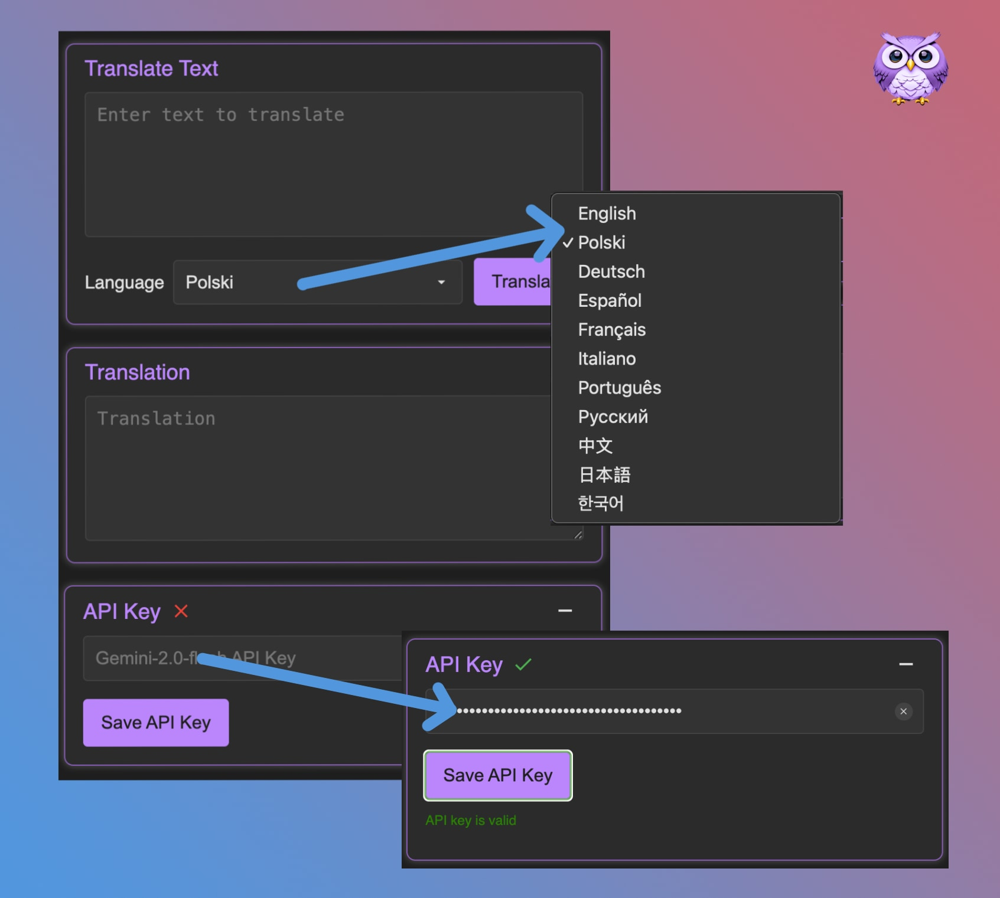

## 
##  AI Translator Gemini API

This Chrome extension allows you to quickly translate selected text on any webpage using the Google Gemini API. You can also translate any text directly within the extension's popup.

## ✨ Features
-   Translate selected text on any webpage.
-   Translate any text directly within the extension's popup.
-   Supports multiple target languages.
-   Saves your Gemini API key securely in your browser's local storage.
-   Collapsible API key settings for a cleaner UI.
-   Displays a loading indicator while translating.
-   Displays a translation dialog box with the translated text.
-   Provides a clear "X" icon to remove the saved API key.
-   Validates the API key format before saving.

## ⚙️ Installation

1.  Download the extension's ZIP archive.
2.  Open Chrome and navigate to `chrome://extensions`.
3.  Enable "Developer mode" in the top right corner.
4.  Click "Load unpacked" and select the extension's directory.

## 🚀 Usage

1.  **Set up your API key:**
    - Open the extension's popup by clicking its icon in your browser toolbar.
    - In the "API Key" section, enter your Gemini API key.
    - Click "Save API Key" to store it securely.
    - You can obtain a Gemini API key from the [Google AI Studio](https://aistudio.google.com/app/apikey).
    - **Note:** An API key is required to use the extension.
        - The API key authenticates your requests to the Gemini API.
        - It is stored securely in your browser's local storage.
        - Your API key is not shared with any third parties.
        - It is used solely for authenticating your requests to the Gemini API.
        - Obtaining an API key is free of charge.
        - The required model is "gemini-2.0-flash-exp".
2.  **To translate text in the popup:**
    - Enter the text you want to translate in the "Translate Text" textarea in the popup.
    - Select the target language.
    - Selected target language will be used for all translations.
    - Click "Translate".
    - The translated text will appear in the "Translation" textarea.
3.  **To translate text on a webpage:**
    - Select the text you want to translate on any webpage.
    - A translation icon will appear near the selected text.
    - Click the translation icon to translate the text.
    - A dialog box will appear with the translated text.
    - You can change the target language in the popup settings.

## 📸 Screenshots (Popup and Select-translation)

## 📋 Requirements

-   A valid Google Gemini API key. You can obtain one from the Google AI Studio.
-   Chrome browser version 88 or higher.

## 🔒 Security

-   Your Gemini API key is stored securely in your browser's local storage.
-   The extension uses HTTPS for all network requests.
-   The extension does not share your API key with any third parties.

## 📜 License

This project is licensed under the [MIT License](LICENSE).

## 🤝 Contributing

Contributions are welcome! Please feel free to submit a pull request.

## 📝 Changelog

### v1.0.0
- Initial release

### v1.1.0
- Changed translation request body
- Added config file
- Added prefix to all classes and IDs

### v1.2.0
- Added separate language selection for selected text translations
- Improved UI consistency across all components
- Added error handling for empty translation requests
- Implemented visual feedback for copy operations
- Fixed position calculation for translation dialog
- Removed close button from translation dialog
- Added prevention for translation icon appearing in dialog content
- Centralized all text strings in configuration file
- Optimized CSS transitions and animations
- Enhanced API key validation process

